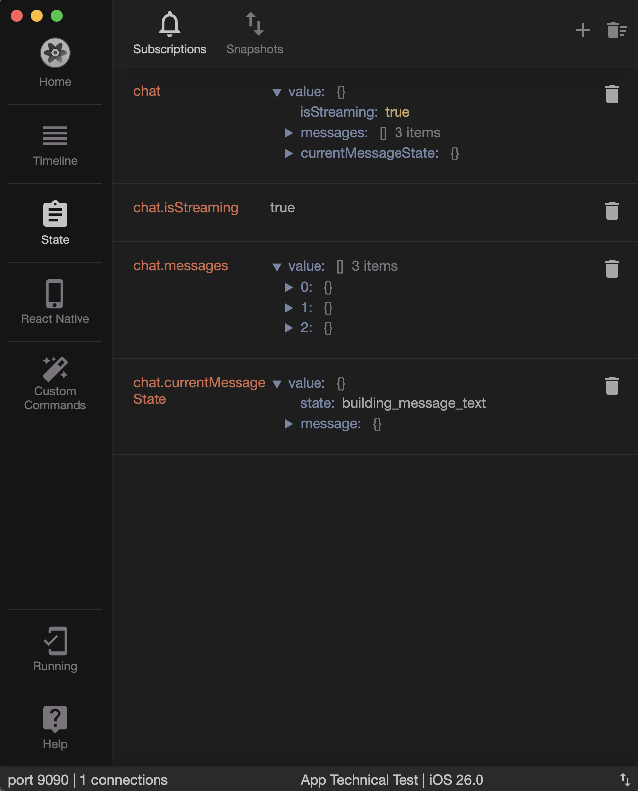

# Getting Started

*Note: This document assumes you are running the project on MacOS. In case you are running on Linux or Windows, please contact me.*

Before running either the app or the tests, ensure you have the following dependencies installed in your local setup:

* [Node.js](https://nodejs.org/en)
* [Xcode](https://developer.apple.com/xcode/) (if you need to run the project in iOS)
* [Android Studio](https://developer.android.com/studio) (if you need to run the project in Android)

## Running the app

This app is built with React Native and [Expo](https://expo.dev/), and runs in iOS and Android. In order to run the app, follow these steps:

* Install the dependencies using `npm`:

```bash
npm i
```

* Run the app:

```bash
npm run start
```

This command will start a new Expo server on your machine, ready to attend incoming connections from mobile devices. 

### Debugging

The app is instrumented on debug with [Reactotron](https://docs.infinite.red/reactotron/), a really handy standalone app that works alongside your app and displays useful information such as network requests/responses and the Redux state. 
Once you have the app running on your device, you can follow the following instructions for using Reactotron to debug it:

* Download the Reactotron desktop app: https://github.com/infinitered/reactotron/releases?q=reactotron-app&expanded=true 
* Open Reactotron.
* Restart your app on your mobile phone by shaking it and clicking on reload.
* You should now be able to inspect the Redux state, and the most important actions that happens while the app is running.



## Running the tests

Tests for this project are built using [Jest](https://jestjs.io/) and [React Testing Library](https://testing-library.com/docs/react-testing-library/intro/). In order to run them:

* Install the dependencies using `npm`:

```bash
npm i
```

* Run the tests:

```bash
npm run test
```
